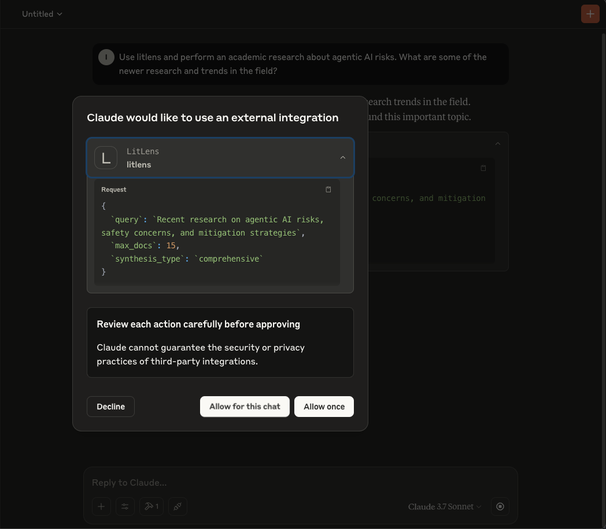
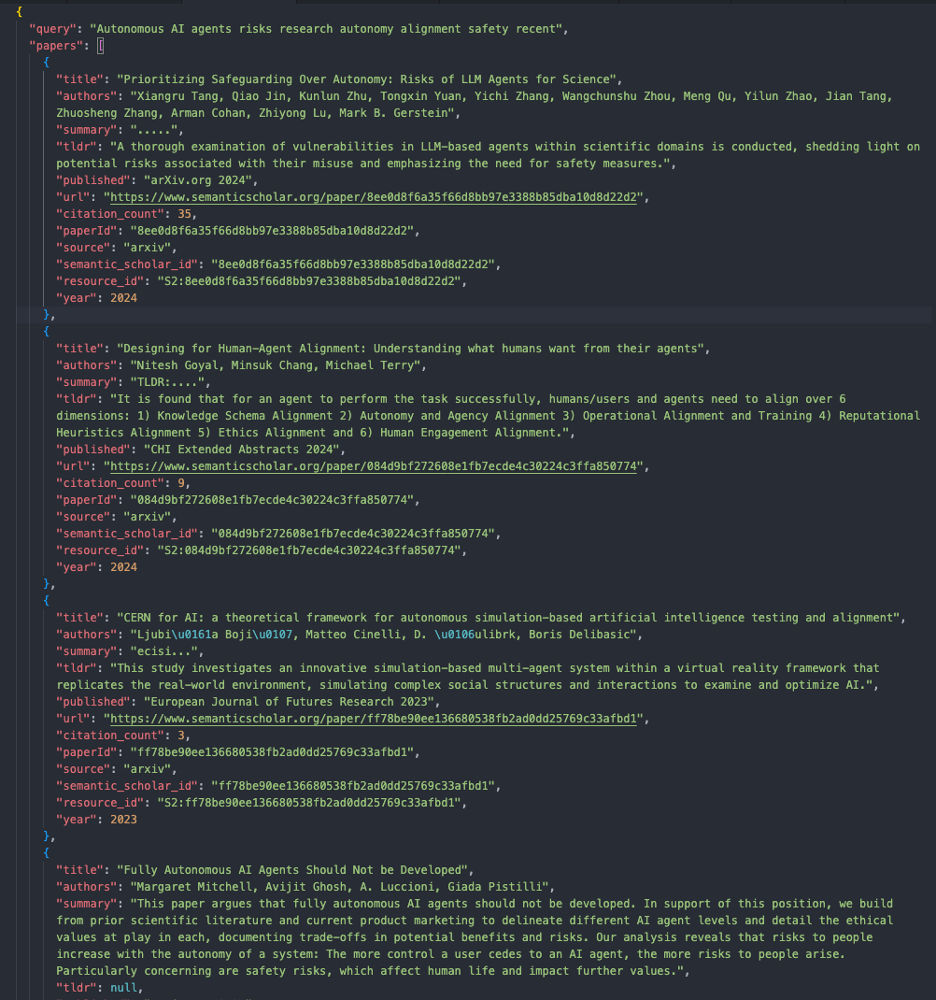

# LitLens: AI-Powered Research Assistant


## ⚠ Disclaimer
This repository was generated with Claude Code assistance. 

It has not been thoroughly vetted.


## Overview

LitLens is an intelligent research assistant system that leverages AI agents to help users efficiently find, analyze, and synthesize academic research. It is available as a local Model Context Protocol (MCP) Server. 

The main development use case currently is to be used in conjunction with Claude Desktop. It has not been tested with other MCP Clients. 

[Short Video Demo](https://drive.google.com/file/d/1wHcbHLCp6EYEQTd4IW1-j1JVpytN1Fj_/view?usp=drive_link) 



## Agents Role Summary

- SourceSeeker: a research agent that searches multiple academic sources. It has access to specific search agents.
  - ArXiv: a search agent for the ArXiv repository.
  - Semantic Scholar: a search agent for the Semantic Scholar repository.
- InsightWeaver: an agent that perform paper analysis and synthesis agent.



## More Details

The system integrates with Claude Desktop as a set of 'extension':

- Claude serves as the conversational interface for the user
- The research agents appear as tools/extensions that Claude can call upon
- The system handles passing information between Claude and the specialized agents

### Communication Flow

1. User submits a research query to Claude
2. Claude formats the query for the LitLens system using MCP
3. LitLens analyzes the query to extract constraints, domains, and subtopics
4. SourceSeeker component searches and returns relevant papers
5. InsightWeaver component performs deep analysis and produces a synthesis with recommendations
6. The system logs the entire transaction with a unique identifier
7. Claude presents findings to the user in a conversational format

### Key Technical Components

- **arXiv API Integration**: For accessing computer science and AI research papers
- **Semantic Scholar API**: For broader academic coverage with citation networks
- **Local Storage**: For caching results and maintaining research session state
- **MCP Protocol Implementation**: For standardized agent-to-agent communication
- **LangChain Agents**: For intelligent search term planning and query refinement
- **Structured Logging System**: JSON logs with UUIDs and timestamps for tracking all transactions
- **Technical Domain Patterns**: Pattern matching for specialized academic fields to improve search relevance
- **Query Intent Analysis**: Extraction of constraints, domains, and subtopics from natural language
- **Async/Await Framework**: Proper event loop management with ThreadPoolExecutor for concurrent tasks


### Installation

1. Clone the repository:
   ```bash
   git clone https://github.com/strivn/litlens
   cd litlens
   ```

2. Set up a virtual environment:
   ```bash
   uv .venv
   uv sync
   ```

3. Configure your environment:
   ```bash
   cp .env.example .env
   # Edit .env to add your OpenAI API key
   ```

4. Copy `mcp_config.json` content to your Claude Desktop MCP configuration file (Go to Settings - Developer - Edit Config)

5. Restart Claude Desktop

### Logging and Debugging

LitLens includes a logging system that captures all transactions:

1. **Log Structure**: Each request generates a timestamped JSON log with a unique UUID
2. **Log Location**: Logs are stored in the `/logs` directory with subdirectories for each component
3. **Log Content**: Logs include the original query, detected constraints, papers found, and synthesis results
4. **Debugging**: When troubleshooting, check the logs to see exactly how queries were processed

## See More
1. For detailed agent descriptions, see [Agent Role Descriptions](docs/agent_role_descriptions.md)
2. For sample interaction transcripts, see [Sample Interaction Transcript](docs/sample_interaction_transcript.md)
3. For detailed output format examples and message flows, see [Output Summary](docs/output_summary.md)
4. For a comprehensive analysis of the system, see [Analysis Report](docs/analysis_report.md)
